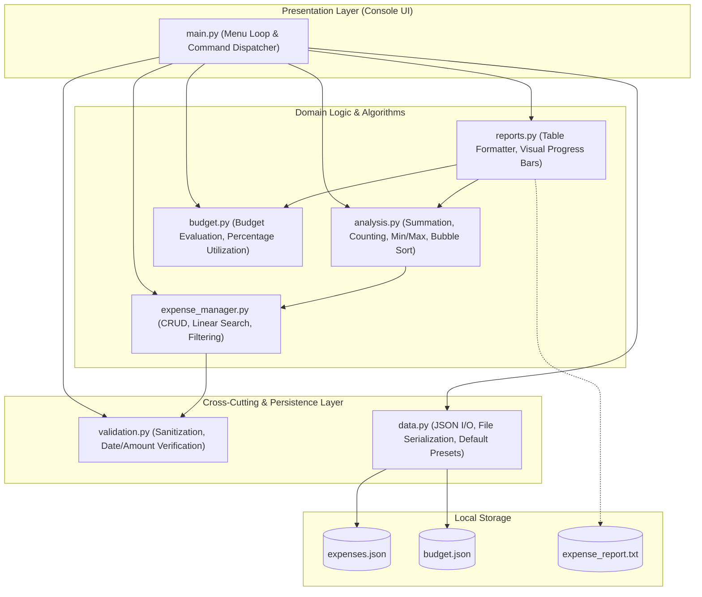
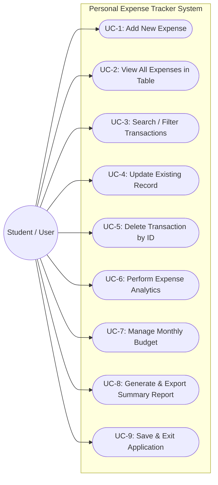
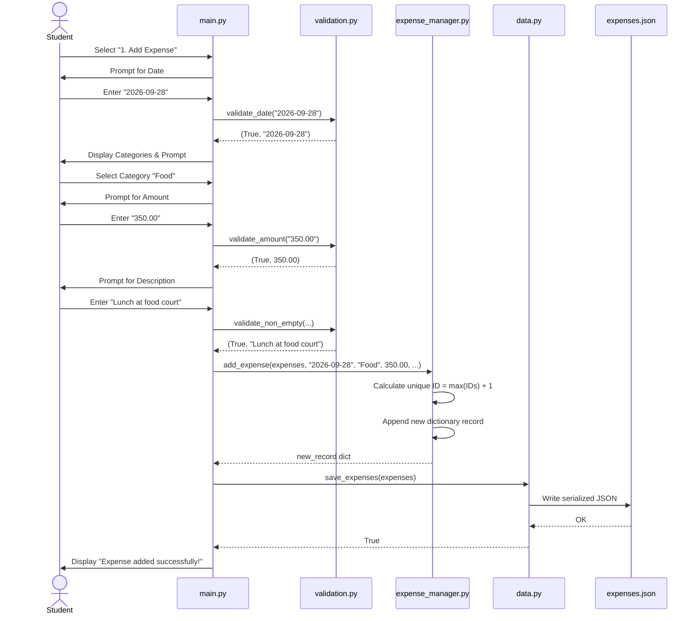
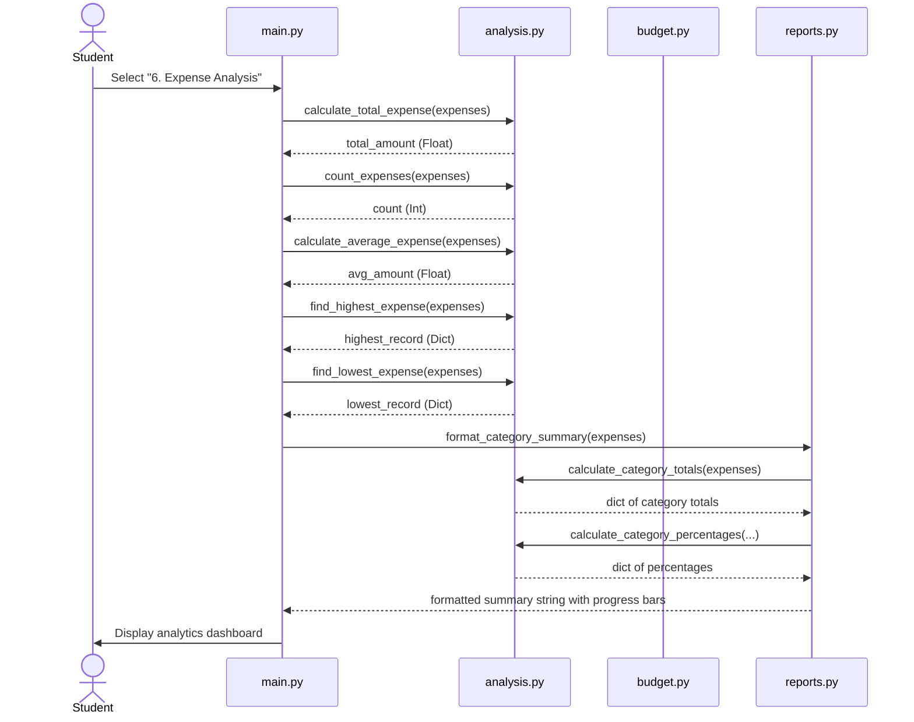

# System Architecture & Design

**Course:** CSE1021 – Introduction to Problem Solving and Programming  
**Author:** Pragya Singh  
**Institution:** Vellore Institute of Technology (VIT), Vellore  

---

## 1. System Architecture

The application uses a **Top-Down Modular Architecture**. The console menu (`main.py`) acts as the controller, interacting with the student in the terminal and dispatching tasks to dedicated modules (`expense_manager`, `analysis`, `budget`, `reports`), while helper modules (`validation`, `data`) take care of input error checking and JSON file storage.



---

## 2. Use Case Diagram

The main user of the application is a **Student / User** who interacts with the program through the terminal.



---

## 3. Component & Module Breakdown

| Module | Responsibilities | Key Functions | Primary Data Structures |
| :--- | :--- | :--- | :--- |
| `main.py` | Command loop, user prompts, menu routing | `main()`, `print_main_menu()`, `prompt_add_expense()` | Strings, Ints, Booleans |
| `expense_manager.py` | In-memory CRUD, search, filter, set operations | `add_expense()`, `find_expense_by_id()`, `search_by_category()`, `delete_expense()` | List of Dictionaries, Sets |
| `analysis.py` | Spending algorithms written from first principles | `calculate_total_expense()`, `count_expenses()`, `find_highest_expense()`, `calculate_category_totals()`, `sort_expenses_by_amount()` | Lists, Dictionaries, Floats |
| `budget.py` | Budget comparison, threshold analysis, status messaging | `evaluate_budget()`, `filter_expenses_by_month()` | Floats, Dictionaries |
| `reports.py` | Aligned ASCII display, tables, progress indicators, export | `format_expense_table()`, `format_category_summary()`, `generate_full_report()`, `export_report_to_file()` | Strings, Lists, Dictionaries |
| `validation.py` | Data validation and input verification | `validate_amount()`, `validate_date()`, `validate_non_empty()`, `validate_menu_choice()` | Tuples, Strings, Floats |
| `data.py` | JSON serialization, file handling, presets | `load_expenses()`, `save_expenses()`, `load_budget()`, `save_budget()` | Lists of Dictionaries, Tuples |

---

## 4. Sequence Diagram: Adding an Expense



---

## 5. Sequence Diagram: Spending Analysis



---

## 6. Data & Storage Structure

### 6.1 Expense Record Structure (Dictionary)
Each expense is stored as a dictionary:
```python
{
    "id": 1,                               # Unique positive integer ID
    "date": "2026-09-28",                  # Calendar date string (YYYY-MM-DD)
    "category": "Food",                    # Category name string
    "amount": 350.00,                      # Numeric amount (INR, 2 decimal places)
    "description": "Lunch at food court"   # Brief note string
}
```

### 6.2 Predefined Categories (Tuple)
Standard categories are stored in an immutable tuple:
```python
DEFAULT_CATEGORIES = (
    "Food",
    "Travel",
    "Shopping",
    "Education",
    "Entertainment",
    "Bills",
    "Other",
)
```

### 6.3 Budget Storage (`budget.json`)
```json
{
    "monthly_budget": 5000.00
}
```

### 6.4 Storage Files
* **`expenses.json`**: List of all expense dictionaries formatted with indentation for readability.
* **`budget.json`**: JSON file holding the monthly budget limit.
* **`expense_report.txt`**: Text file export containing formatted ASCII tables, budget status, and category breakdowns.
