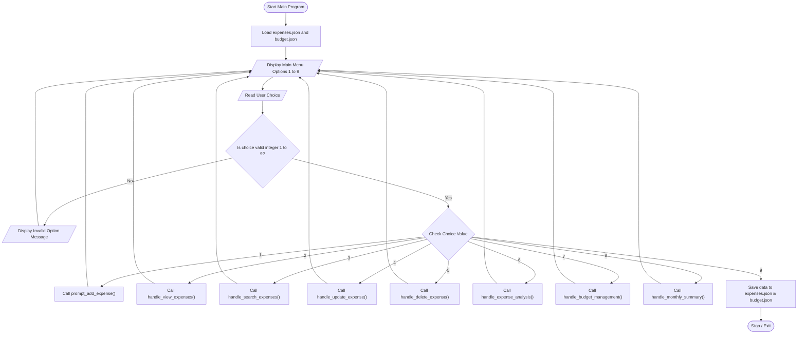
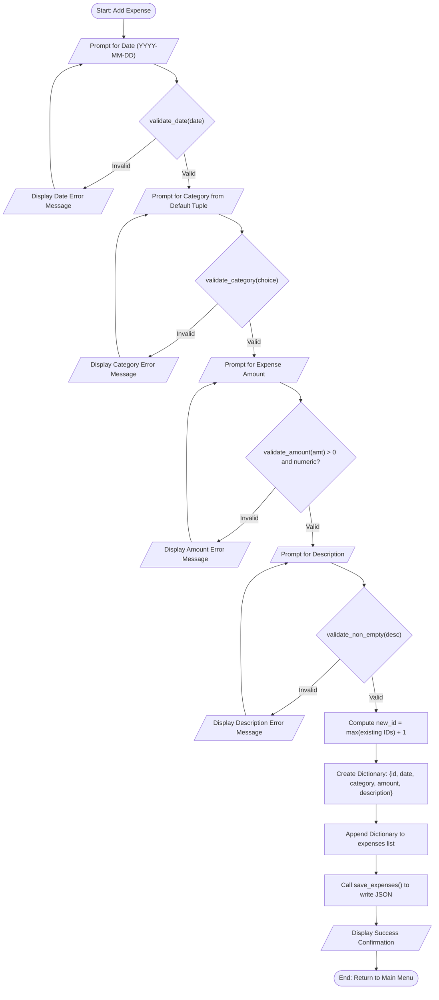
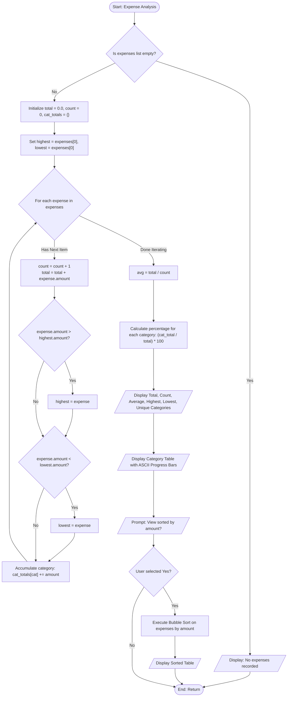
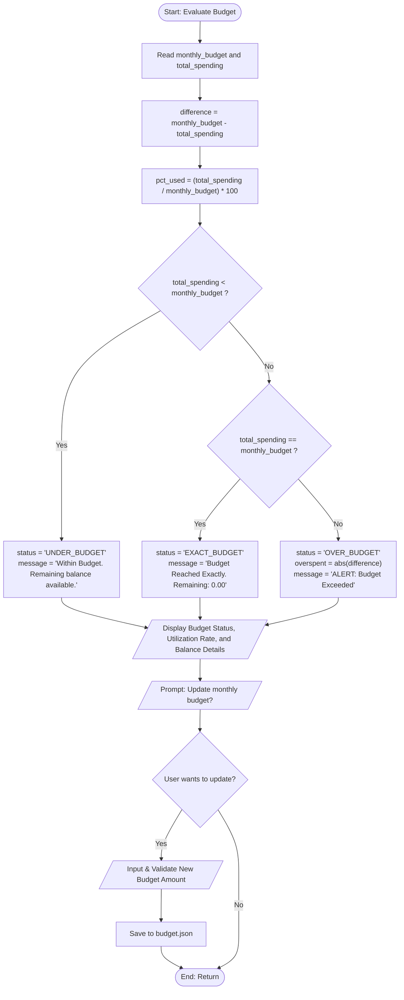
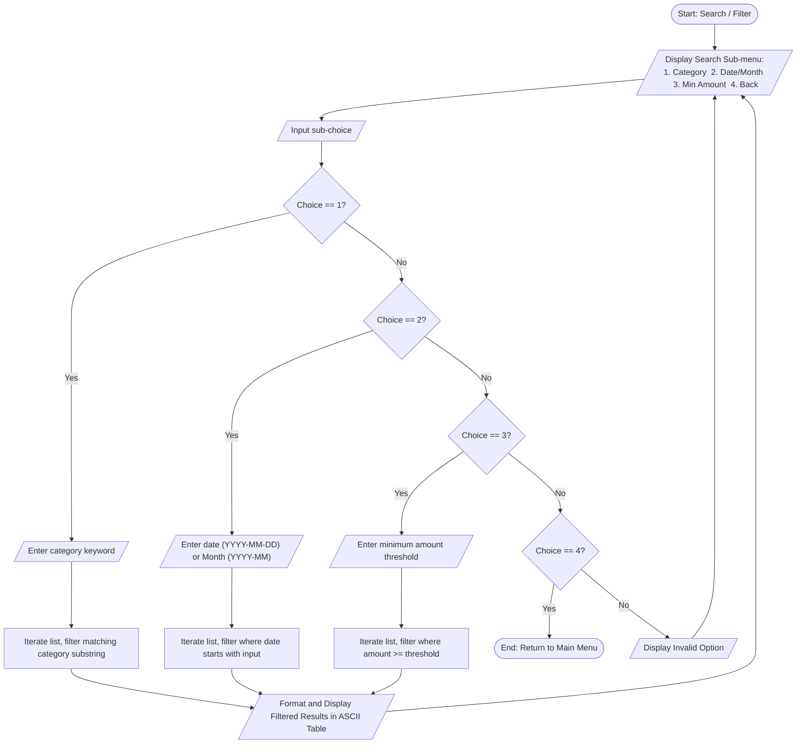

# Flowcharts: Personal Expense Tracker

**Course:** CSE1021 – Introduction to Problem Solving and Programming  
**Author:** Pragya Singh  
**Institution:** Vellore Institute of Technology (VIT), Vellore  

---

## 1. Main Program Workflow

---

## 2. Add Expense Flow

---

## 3. Expense Analysis Flow

---

## 4. Budget Evaluation Flow

---

## 5. Search & Filter Flow

