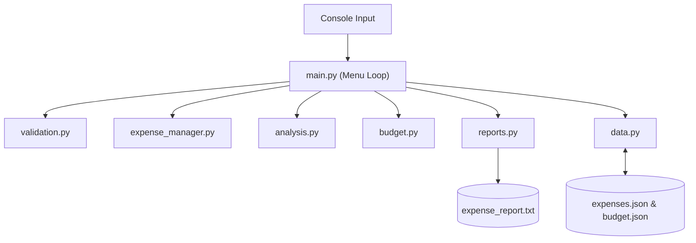
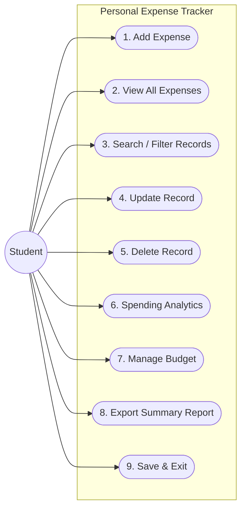
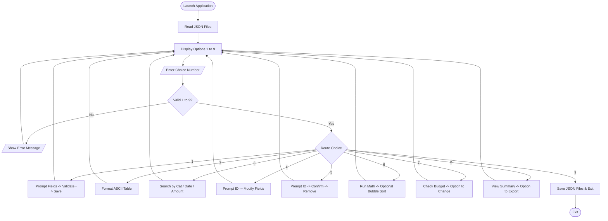
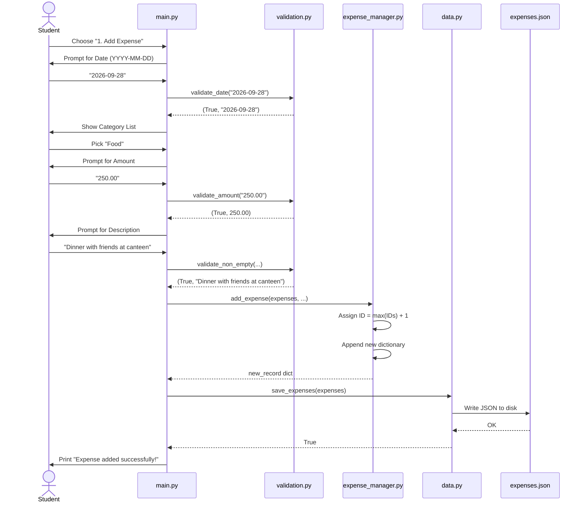
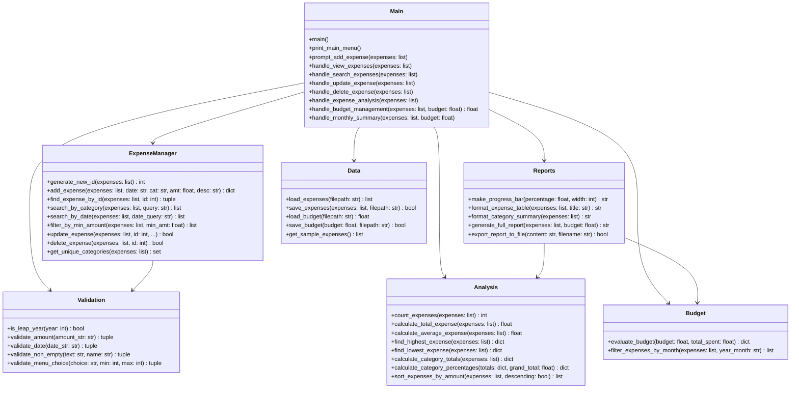

# Academic Project Report

---

# Vellore Institute of Technology
### School of Computer Science and Engineering (SCOPE)
### CSE1021 – Introduction to Problem Solving and Programming

---

## Project Title
# **Personal Expense Tracker Using Python**

* **Student Name:** Pragya Singh
* **Degree & Branch:** B.Tech Computer Science and Engineering
* **Course:** CSE1021 – Introduction to Problem Solving and Programming
* **Semester:** Fall Semester 2026–2027
* **Institution:** Vellore Institute of Technology (VIT), Vellore, Tamil Nadu

---

## Table of Contents
1. Project Overview
2. Introduction & Background
3. Problem Definition
4. Goals and Objectives
5. Functional Description
6. Non-Functional Aspects
7. System Architecture
8. Use Case Model
9. Process Workflow
10. Sequence of Operations
11. Module Decomposition
12. Data Structures and Storage
13. Design Choices & Rationale
14. Implementation Breakdown
15. Sample Runs & Console Screenshots
16. Testing Strategy & Results
17. Practical Challenges & Solutions
18. Key Learnings & Takeaways
19. Future Enhancements
20. References

---

## 1. Project Overview
* **Project Name:** Personal Expense Tracker
* **Author:** Pragya Singh
* **Course:** CSE1021 – Introduction to Problem Solving and Programming
* **Language:** Python 3.10+ (Standard Library)
* **Storage:** Local JSON files (`expenses.json`, `budget.json`)
* **Target Audience:** College students managing pocket money or monthly allowances

---

## 2. Introduction & Background
Moving into a hostel or student apartment at VIT is usually the first time many of us have to look after our own finances without parents handling day-to-day purchases. Every month starts with a fixed allowance. From there, money goes out in bits and pieces almost every day: quick lunches at the food court, hot samosas and cold coffee at Gazebo, auto rides to Katpadi junction, printing lab observation sheets, buying notebooks, mobile data recharges, and weekend hangouts.

None of these expenses feel particularly large on their own—usually ₹30 to ₹250 at a time. But because they happen constantly through small UPI payments and cash, they slip past unnoticed. By the third week of the month, bank balances drop unexpectedly low, leaving students wondering where their allowance actually went.

I built this **Personal Expense Tracker** to tackle this everyday problem. Developed as my course project for **CSE1021 – Introduction to Problem Solving and Programming**, the project turns a real student struggle into an algorithmic problem. It puts into practice all the core programming techniques we covered in class—loops, conditional logic, functions, lists, dictionaries, tuples, sets, file handling, and basic algorithms like summation, linear search, and bubble sort—without leaning on heavy external packages or online database setups.

---

## 3. Problem Definition
Most college students find it tough to stay within their monthly allowance for a few simple reasons:
1. **Scattered micro-spending:** Small cash and UPI transactions happen multiple times a day without being written down.
2. **No category visibility:** Without grouping expenses, it is easy to assume that money went toward course materials when a large chunk was actually spent on evening snacks and food deliveries.
3. **Budget blind spots:** There is no warning system before the allowance runs out. Most students only realize they have overspent when a UPI payment fails or their balance hits zero.
4. **App bloat:** Existing smartphone apps are frustrating to use. They push ads, ask for intrusive SMS and banking permissions, demand cloud accounts, and refuse to work without active internet.

Students just need a fast, private terminal tool: open it up, record what you spent in five seconds, check how much budget is left, and close it.

---

## 4. Goals and Objectives

### Primary Goal
To design and build an easy-to-use, offline Python console application that lets students record, organize, analyze, and budget their daily expenses, directly applying foundational problem-solving techniques learned in CSE1021.

### Practical Objectives
- Allow quick entry of expenses with date, category, amount, and note, assigning an incremented integer ID to each record.
- Present records in an aligned ASCII table with running totals.
- Support filtering by category name, specific dates, entire months, or a minimum rupee threshold.
- Allow in-place editing of previous records and safe deletion with a confirmation prompt.
- Calculate spending metrics from first principles using manual loops: total expenditure, count, average per transaction, highest and lowest expenses, category percentages, text progress bars, and bubble sort.
- Monitor spending against a user-defined monthly budget limit and provide clear feedback on remaining balance or deficit.
- Export clean overview reports to `expense_report.txt`.
- Save all data automatically in local JSON files so records are kept between program runs.

---

## 5. Functional Description

### 5.1 Adding & Managing Records
When logging a new expense, the program prompts for the date, category, amount, and a brief description. Each field is validated immediately. It automatically generates a unique ID by finding the maximum ID currently stored and adding 1. Users can update mistakes in previously saved entries (leaving fields blank to keep current values) or delete an unwanted entry after answering a confirmation prompt.

### 5.2 Searching & Filtering
To make locating past expenses simple, I created three separate search options:
- **By Category:** Performs a case-insensitive search (e.g. typing `food` retrieves all records under `Food`).
- **By Date or Month:** Matches exact dates (`2026-09-05`) or month prefixes (`2026-09`) to view monthly spending.
- **By Minimum Amount:** Filters for larger expenses (e.g. all purchases of ₹500 or more).

### 5.3 Calculations & Analytics
All mathematical routines are coded by hand using standard Python loops:
- Grand total and transaction count via explicit accumulation loops.
- Average transaction amount, protected with boundary checks to prevent division-by-zero on empty lists.
- Highest and lowest single transactions found through iterative scanning.
- Category breakdown with monetary totals, percentage shares, and text progress bars (`[====------]`).
- In-place Bubble Sort to view spending ranked from highest amount to lowest.

### 5.4 Budget Monitoring & Report Export
Users can set a target monthly budget (defaulting to ₹5,000). The tool compares actual spending against this limit and alerts the user whether they are safely under budget, exactly at the limit, or over budget. A complete monthly overview can also be written to a plain text file (`expense_report.txt`) on demand.

### 5.5 File Storage
Everything is stored locally in `expenses.json` and `budget.json` right in the project folder. No cloud connection or database installation is needed.

---

## 6. Non-Functional Aspects

- **Defensive Error Handling:** If a user accidentally types text for an amount or enters an invalid date like April 31st, the program does not crash with an unhandled traceback. It displays a clear error and re-prompts gently.
- **Zero Third-Party Dependencies:** Built entirely with Python's built-in standard library (`json`, `os`, `sys`, `unittest`). It runs on any machine with standard Python installed.
- **Immediate Response:** Because student expense lists generally contain tens or hundreds of items, all search, filter, and sorting operations finish in less than 5 milliseconds.
- **Clean Structure:** The project is organized into 7 distinct files, each handling a single responsibility, making code review and debugging straightforward.

---

## 7. System Architecture
The application uses a clean **3-Tier Modular Structure**:
1. **Presentation Layer (`main.py`):** Drives the menu loop, captures user choices, and routes commands.
2. **Business Logic Layer (`expense_manager.py`, `analysis.py`, `budget.py`, `reports.py`):** Handles CRUD actions, calculations, budget evaluations, and ASCII formatting.
3. **Data & Validation Layer (`data.py`, `validation.py`):** Manages input sanitization and reads/writes local JSON files.



---

## 8. Use Case Model



---

## 9. Process Workflow



---

## 10. Sequence of Operations: Adding an Expense



---

## 11. Module Decomposition



---

## 12. Data Structures and Storage

### 12.1 Expense Record (Dictionary)
Each transaction is modeled as a readable Python dictionary:
```python
{
    "id": 1,
    "date": "2026-09-02",
    "category": "Education",
    "amount": 1200.00,
    "description": "Semester reference textbooks and stationery"
}
```

### 12.2 Category Tuple (Immutable Sequence)
Preset categories are stored in a tuple to prevent accidental alteration during runtime:
```python
DEFAULT_CATEGORIES = (
    "Food",
    "Travel",
    "Shopping",
    "Education",
    "Entertainment",
    "Bills",
    "Other"
)
```

### 12.3 Unique Categories (Set)
A Python `set` is used to gather distinct category names across records without duplicates:
```python
unique_categories = set(expense["category"] for expense in expenses)
```

### 12.4 Local Files
* **`expenses.json`**: An indented JSON list holding all expense dictionaries.
* **`budget.json`**: Simple JSON file storing the monthly budget value.
* **`expense_report.txt`**: Destination text file when exporting summary reports.

---

## 13. Design Choices & Rationale

- **Why pure Python standard library?**  
  In a first-year programming course like CSE1021, the objective is to understand how algorithms actually operate. If I relied on `pandas` or `numpy` and simply called `.sum()` or `.sort_values()`, it would bypass the learning process. Writing my own summation loops, min/max comparisons, and bubble sort ensures I understand every line of execution.
- **Why a list of dictionaries?**  
  It mirrors how database rows work. The outer list keeps items in sequential order, while each dictionary lets me access fields by intuitive names (`expense['amount']`) rather than arbitrary index numbers.
- **Why tuples for categories?**  
  Category names should stay constant while the program runs. A tuple guarantees that standard options cannot be accidentally modified or deleted.
- **Why local JSON files instead of SQL?**  
  Setting up external database engines creates unnecessary configuration steps for anyone trying to evaluate or run the project. JSON files are human-readable, lightweight, and supported natively by Python without extra installs.

---

## 14. Implementation Breakdown
The project is divided across 7 files with focused purposes:
1. **`validation.py`:** Checks dates (format, month bounds, leap years), amounts, and menu choices to protect against crashes.
2. **`expense_manager.py`:** Contains the list operations: adding records, generating IDs, searching, updating, and deleting.
3. **`analysis.py`:** Calculates spending totals, averages, extremes, category sums, and implements bubble sort.
4. **`budget.py`:** Evaluates spending against the budget limit and formats clean status messages.
5. **`reports.py`:** Formats aligned ASCII tables, text progress bars, and exports summary files.
6. **`data.py`:** Handles reading and writing JSON files and provides starter student sample data.
7. **`main.py`:** Runs the interactive menu loop and coordinates actions based on user input.

---

## 15. Sample Runs & Console Screenshots

### 15.1 Main Menu Screen
```text
========================================================
   Personal Expense Tracker (VIT - CSE1021 Project)
                   by Pragya Singh
========================================================
Loaded 8 expense records. Current budget: INR 5000.00.

================================================
        PERSONAL EXPENSE TRACKER
================================================
  1. Add Expense
  2. View All Expenses
  3. Search / Filter Expenses
  4. Update Expense
  5. Delete Expense
  6. Expense Analysis
  7. Set / View Monthly Budget
  8. Monthly Summary Report
  9. Save and Exit
================================================
Enter your choice (1-9): 
```

### 15.2 All Expenses Tabular View
```text
+-----------------------------------------------------------------------------------------+
|                                   ALL EXPENSE RECORDS                                   |
+------+------------+-----------------+--------------+------------------------------------+
|  ID  |    Date    |    Category     | Amount (INR) |            Description             |
+------+------------+-----------------+--------------+------------------------------------+
|    1 | 2026-09-02 | Education       |      1200.00 | Semester reference textbooks an... |
|    2 | 2026-09-05 | Food            |       350.00 | VIT food court lunch with hoste... |
|    3 | 2026-09-08 | Travel          |       220.00 | Auto fare to Katpadi railway st... |
|    4 | 2026-09-12 | Bills           |       499.00 | Monthly high-speed mobile data ... |
|    5 | 2026-09-15 | Entertainment   |       300.00 | Weekend movie ticket               |
|    6 | 2026-09-18 | Shopping        |       850.00 | Replacement scientific calculat... |
|    7 | 2026-09-22 | Food            |       180.00 | Evening snacks and juice at Gazebo |
|    8 | 2026-09-25 | Education       |       450.00 | Lab record notebook and project... |
+------+------------+-----------------+--------------+------------------------------------+
| TOTAL (8 items)                     |      4049.00 |                                    |
+-----------------------------------------------------------------------------------------+
```

### 15.3 Analytics & Category Breakdown View
```text
====================================================================
                   EXPENSE ANALYTICS
====================================================================
  * Total Transactions Recorded : 8
  * Total Expenditure           : INR 4049.00
  * Average Expense Amount      : INR 506.12
  * Unique Expense Categories   : 6 (Bills, Education, Entertainment, Food, Shopping, Travel)
  * Highest Single Transaction  : INR 1200.00 (ID #1 - Education)
  * Lowest Single Transaction   : INR 180.00 (ID #7 - Food)

====================================================================
               CATEGORY-WISE SPENDING BREAKDOWN
====================================================================
Category         |  Total (INR) | Share of Total                
--------------------------------------------------------------------
Bills            |       499.00 | [==--------------]  12.3%
Education        |      1650.00 | [=======---------]  40.8%
Entertainment    |       300.00 | [=---------------]   7.4%
Food             |       530.00 | [==--------------]  13.1%
Shopping         |       850.00 | [===-------------]  21.0%
Travel           |       220.00 | [=---------------]   5.4%
--------------------------------------------------------------------
Grand Total      |      4049.00 | 100.0%
====================================================================
```

### 15.4 Budget Management Screen
```text
==================================================
               BUDGET MANAGEMENT
==================================================
  Current Monthly Budget : INR 5000.00
  Total Spending to Date : INR 4049.00
  Budget Status          : UNDER_BUDGET
  Utilization Rate       : 81.0%
  Details                : Within budget: you have spent INR 4049.00 of INR 5000.00. Remaining balance: INR 951.00 (19.0% remaining).
```

---

## 16. Testing Strategy & Results
I wrote an automated test suite using Python's standard `unittest` library to verify all core functions under normal, boundary, and invalid conditions:
- **Test File:** `tests/test_expense_tracker.py`
- **Total Tests:** 30 unit tests
- **Result:** 30 passed in ~0.005 seconds (100% pass rate)

Tested areas include:
1. **Validation Checks:** Valid numeric amounts, non-numeric inputs, negative amounts, zero amounts, valid dates, leap year February 29th logic, invalid month bounds, blank descriptions, and menu choice ranges.
2. **Expense Operations:** Adding records, looking up by ID, updating specific fields, deleting by ID, searching by category, searching by date prefix, filtering by minimum amount, and gathering unique categories.
3. **Algorithms:** Summation loop, transaction counter, average spending, finding maximum and minimum entries, category totals, percentage shares, and bubble sort in both ascending and descending order.
4. **Budget Checks:** Under budget, exact budget reached, and over-budget conditions.
5. **Persistence:** Roundtrip saving and reading from JSON files, and fallback to sample data when a file is absent.

---

## 17. Practical Challenges & Solutions

1. **Handling Calendar Dates and Leap Years Manually:**  
   *Problem:* Different months have 28, 30, or 31 days, and February has 29 days during leap years. I wanted to catch invalid dates like `2026-02-29` or `2026-04-31` without importing third-party calendar packages.  
   *Solution:* I wrote a helper `is_leap_year(year)` using standard modulo arithmetic (`year % 4 == 0 and (year % 100 != 0 or year % 400 == 0)`) and paired it with a tuple lookup `(0, 31, 28, 31, 30, ...)` to validate day limits accurately.

2. **Preventing Program Crashes on Typographical Errors:**  
   *Problem:* During early testing, accidentally typing letters for an amount or entering a wrong menu option caused an unhandled `ValueError`, crashing the application immediately.  
   *Solution:* I encapsulated user input parsing in validation functions wrapped in `try...except ValueError` blocks. Instead of crashing, the function returns an error message and the loop allows the user to re-enter their choice.

3. **Avoiding Division by Zero in Analytics:**  
   *Problem:* If a user runs spending analytics when no expenses are recorded, computing `total / count` triggers a `ZeroDivisionError`.  
   *Solution:* I placed boundary guards in `calculate_average_expense` and `calculate_category_percentages` to return `0.0` whenever the count or total is zero.

4. **Preserving Record IDs Across Deletions:**  
   *Problem:* Initially, I considered using list indices as IDs. But deleting an item shifted subsequent indices, causing confusion when looking up records later.  
   *Solution:* I gave each entry a permanent integer ID generated by finding the current highest ID and adding 1.

---

## 18. Key Learnings & Takeaways
- **Breaking Big Problems Down:** Splitting code across 7 specialized files made debugging and testing much smoother than trying to manage everything in a single 600-line script.
- **Picking the Right Data Structure:** 
  - Lists work best for maintaining an ordered series of transactions.
  - Dictionaries make records readable by pairing descriptive keys like `"amount"` with values.
  - Tuples protect constant values like default categories from accidental runtime changes.
  - Sets make finding unique categories straightforward.
- **Building Algorithms Directly:** Writing summation, counting, min/max, and bubble sort by hand helped me truly understand how data moves through loops step-by-step.
- **The Power of Automated Tests:** Running unit tests with `unittest` helped me catch subtle edge cases early and gave me confidence that changes didn't break existing functionality.

---

## 19. Future Enhancements
- **Multi-Month History:** Support storing expenses across multiple months with month-over-month spending comparisons.
- **Category Spending Caps:** Allow setting individual monthly budgets for specific categories (e.g. limiting "Food" to ₹2,000).
- **CSV Export:** Add an option to export data into a `.csv` format so records can be opened in Microsoft Excel or Google Sheets.
- **Simple Graphical Interface:** Build an optional visual interface using Python's built-in `tkinter` library while keeping the existing core logic intact.

---

## 20. References
1. Reema Thareja, *Python Programming: Using Problem Solving Approach*, Oxford University Press, 2017.
2. Allen B. Downey, *Think Python: How to Think Like a Computer Scientist*, 2nd Edition, O'Reilly Media, 2015.
3. Python Software Foundation, *Python 3.12+ Official Documentation*, https://docs.python.org/3/
4. VIT University, *CSE1021 – Introduction to Problem Solving and Programming Course Syllabus & Lab Manual*, SCOPE, Vellore.
